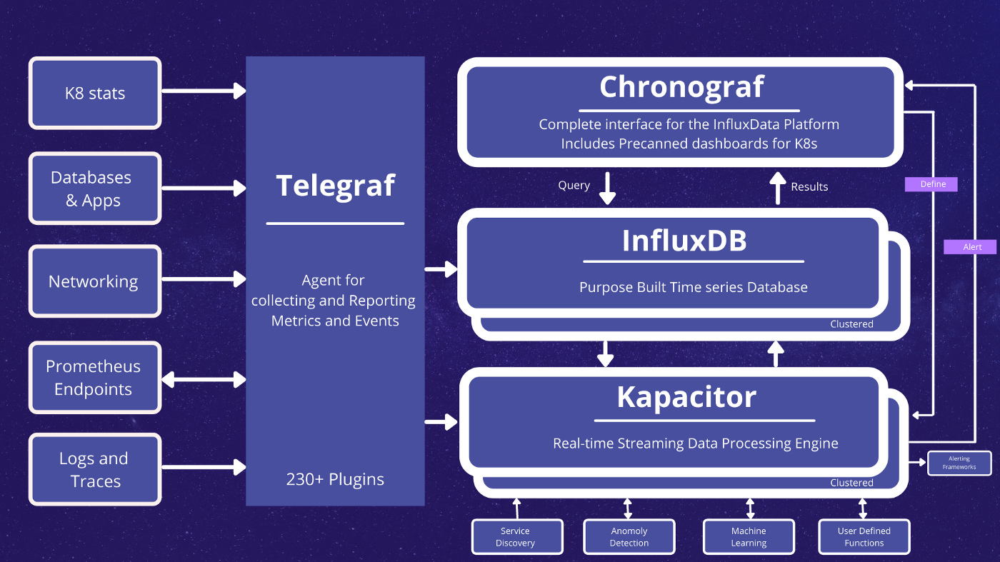

# InfluxDB 2 사용기

## InfluxDB?

InfluxDB 는 세계에서 가장 많이 사용하고 가장 유명한 TSDB 이다. Go 언어로 개발되어 2013년에 처음 릴리즈되었고 현재(2022-08-02 기준)는 2.3.0 버전까지 릴리즈되었다.  

### TSDB 는 또 뭐지?

TSDB 는 `Time Series Database` 의 줄임말로 시계열 데이터베이스이다. TSDB 는 시계열 데이터, 즉 시간의 흐름에 따라 생성되고 변화하는 데이터를 처리에 매우 유용하다.  
Time Stamp 를 기반으로 데이터 저장소를 운영한다. 저장소에 시간을 기준으로 나누어 데이터를 저장하고 이를 압축하고 요약하는 최적화된 압축 알고리즘을 사용하여 데이터 양이 증가함에 따라 발생하는 성능 이슈에 매우 강한 내성을 가지고 있다.  

다만 장점만 있는것이 아니다. TSDB 는 시간이 흘러가면서 쌓이는 데이터를 처리하기 위해서 설계되었다. 때문에 삭제나 수정과 같은 기존 데이터를 변경하는 기능을 제한하고 있다.  
또한 데이터를 오름차순으로 정렬하고 있기 때문에 임의의 시간의 데이터를 읽고 쓰는 작업의 성능이 다소 떨어지는 경향이 있다.

때문에 RDB 로 처리하던 것을 모두 TSDB 로 이전할 필요는 없다. 모든 요구사항을 만족하는 기술은 찾기 힘들 뿐더러 존재 여부조차 알아내기 어렵다. 따라서 내가 필요한 목적에 따라 적절한 데이터베이스를 선정해서 사용하는 것이 최적의 선택일 것이다.

## Version 1 vs. Version 2

InfluxDB 는 2019년 1월 25일에 v2.0.0-alpha.1 버전을 릴리즈 하였다. 1년 후 2020년 1월 8일 v2.0.0-beta.1 버전이 릴리즈 되었다.  
9개월 뒤 정식 릴리즈 후보인 2020년 10월 14일 v2.0.0-rc.1 버전이 릴리즈 되었고, 2020년 11월 9일 정식으로 v2.0.0 버전이 릴리즈 되었다.

InfluxDB 1 은 influx data 사에서 `TICK Stack` 이라고 하는 서비스 스택의 하나였다. 이를 InfluxDB 2 에서 파편화된 서비스 모듈을 통합하였다.  
InfluxDB 2 에서는 모니터링 데이터를 수집하는 에이전트인 `Telegraf` 를 제외한 나머지 서비스 스택의 집합체이다.

### Tick Stack

- T(Telegraf): 모니터링 메트릭 수집 에이전트
- I(InfluxDB): 시계열 데이터베이스
- C(Chronograf): InfluxDB 에 증적된 데이터 가시화 모듈
- K(Kapacitor): 스트림 및 데이터 처리 엔진

### Reference.

- https://mangkyu.tistory.com/190
- https://foreverhappiness.tistory.com/58