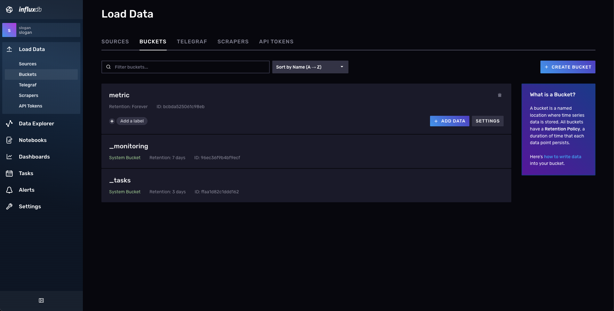
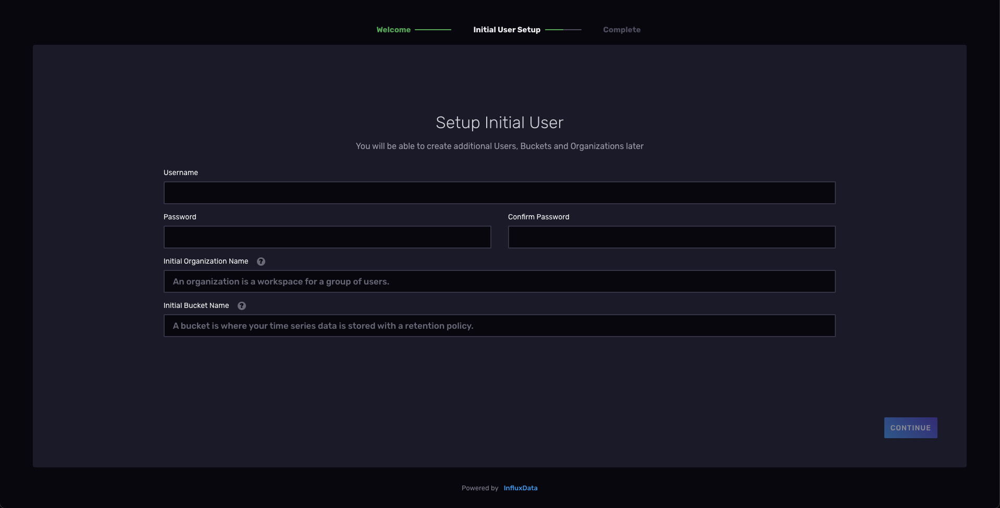
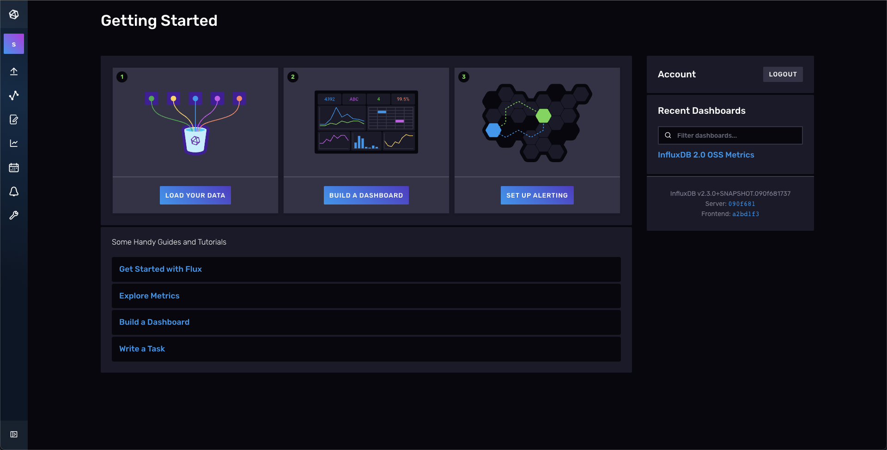
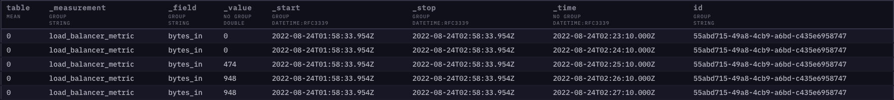

# InfluxDB 2 사용기

## InfluxDB?

InfluxDB 는 세계에서 가장 많이 사용하고 가장 유명한 TSDB 이다. Go 언어로 개발되어 2013년에 처음 릴리즈되었고 현재(2022-08-02 기준)는 2.3.0 버전까지 릴리즈되었다.  

### TSDB 는 또 뭐지?

TSDB 는 `Time Series Database` 의 줄임말로 시계열 데이터베이스이다. TSDB 는 시계열 데이터, 즉 시간의 흐름에 따라 생성되고 변화하는 데이터를 처리에 매우 유용하다.  
Time Stamp 를 기반으로 데이터 저장소를 운영한다. 저장소에 시간을 기준으로 나누어 데이터를 저장하고 이를 압축하고 요약하는 최적화된 압축 알고리즘을 사용하여 데이터 양이 증가함에 따라 발생하는 성능 이슈에 매우 강한 내성을 가지고 있다.  

다만 장점만 있는것이 아니다. TSDB 는 시간이 흘러가면서 쌓이는 데이터를 처리하기 위해서 설계되었다. 때문에 삭제나 수정과 같은 기존 데이터를 변경하는 기능을 제한하고 있다.  
또한 데이터를 오름차순으로 정렬하고 있기 때문에 임의의 시간의 데이터를 읽고 쓰는 작업의 성능이 다소 떨어지는 경향이 있다.

때문에 RDB 로 처리하던 것을 모두 TSDB 로 이전할 필요는 없다. 모든 요구사항을 만족하는 기술은 찾기 힘들 뿐더러 존재 여부조차 알아내기 어렵다. 따라서 내가 필요한 목적에 따라 적절한 데이터베이스를 선정해서 사용하는 것이 최적의 선택일 것이다.

## Version 1 vs. Version 2

InfluxDB 는 2019년 1월 25일에 v2.0.0-alpha.1 버전을 릴리즈 하였다. 1년 후 2020년 1월 8일 v2.0.0-beta.1 버전이 릴리즈 되었다.  
9개월 뒤 정식 릴리즈 후보인 2020년 10월 14일 v2.0.0-rc.1 버전이 릴리즈 되었고, 2020년 11월 9일 정식으로 v2.0.0 버전이 릴리즈 되었다.

InfluxDB 1 은 influx data 사에서 `TICK Stack` 이라고 하는 서비스 스택의 하나였다. 이를 InfluxDB 2 에서 파편화된 서비스 모듈을 통합하였다.  
InfluxDB 2 에서는 모니터링 데이터를 수집하는 에이전트인 `Telegraf` 를 제외한 나머지 서비스 스택의 집합체이다.

### Tick Stack


- T(Telegraf): 모니터링 메트릭 수집 에이전트
- I(InfluxDB): 시계열 데이터베이스
- C(Chronograf): InfluxDB 에 증적된 데이터 가시화 모듈
- K(Kapacitor): 스트림 및 데이터 처리 엔진

## 데이터 저장소 명칭 차이

### Version 1

InfluxDB 1 은 RDB 와의 유사성이 많다. RDB 에서 Schema(Database) 와 유사하게 database 라고 하는 최상위 저장소가 있다.

```
Connected to http://localhost:8086 version 1.8.10
InfluxDB shell version: 1.8.10
> show databases;
name: databases
name
----
_internal
```

그 하위에는 RDB 에서는 Table 과 매칭되는 Measurements 가 있다.

```
> use _internal
Using database _internal
> show measurements;
name: measurements
name
----
cq
database
httpd
queryExecutor
runtime
shard
subscriber
tsm1_cache
tsm1_engine
tsm1_filestore
tsm1_wal
write
```

### Version 2

2 버전부터는 Organization 라는 workspace 분리를 위한 개념이 추가되었다.

> An organization is a workspace for a group of users requiring access to time series data, dashboards, and other resources. You can create organizations for different functional groups, teams, or projects.

또한 Database 의 개념 대신에 Bucket 으로 대체 되었다.



이 때문에 처음 InfluxDB 를 초기화 한다면 Organization 과 Bucket 생성을 위한 내용을 입력하게 된다.



처음 설정을 마치게되면 InfluxDB 2 버전을 사용할 준비가 모두 끝났다.



## Data 구조

1 버전에서는 RDB 에서의 Table 구조과 매우 유사하다. 다만 필수적으로 time column 이 들어간다.  
하지만 2 버전부터 저장되는 Data 구조가 변경되었다.



- `_measurement`: 구분 값, RDB 의 Table 개념과 유사
- `_field`: 수집되는 값에 대한 명칭, RDB 의 Column 명 개념과 유사
- `_value`: 실제 데이터 값
- `_start`: 조회 시 요청 한 시작 시간
- `_stop`: 조회 시 요청 한 끝 시간
- `_time`: 데이터가 입력된 시간
- `id`: 데이터의 ID, column 명 변경 가능
- `table`: 조회된 데이터의 field 수 만큼 table 값 증가

## Flux Query

InfluxDB 는 InfluxQL 을 지원한다. InfluxQL 은 RDB 에서 하용하는 SQL 과 대동소이 하지만 `SELECT INTO`, `ALTER`, `CREATE`, `DROP`, `GRANT`, `KILL`, `REVOKE` 기능을 지원하지 않는다.  
여기에 추가로 1.8 버전 이후로 **Flux** 언어를 이용한 Query 를 추가로 지원한다.

### Flux 란?

조회, 분석 및 데이터 처리를 위해 설계된 데이터 스크립팅 언어이다.  
아래 예시는 `example-bucket` bucket 에서 1시간 전부터 현재 시간까지 증적된 모든 데이터를 조회하는 Flux 예시 코드다.

```
from(bucket:"example-bucket")
    |> range(start: -1h)
```

#### 간단 사용법

데이터를 조회하기 위해선 먼저 bucket 을 지정해야한다. `from()` 함수로 데이터를 조회할 bucket 을 특정한다.

```
from(bucket: "example-bucket")
```

이후 Pipe-Forward Operator(`|>`)를 사용해서 다음 function 에 데이터를 전달한다. [water treatment metaphor](https://docs.influxdata.com/flux/v0.x/get-started/#flux-overview) 형식의 데이터 흐름을 생각한다면 이해하기 쉬울것이다.  
다음은 조회 범위를 정해야한다. `range(start: {startDate}, stop: {stopDate})` 함수를 이용하여 시작과 종료 시간을 지정한다.  
`range(start: -1h)` 와 같이 조회 요청 시점으로 부터 1시간 전 데이터를 조회할 수 있다.

```
from(bucket: "example-bucket")
    |> range(start: -1d)
```

`filter(fn: (r) => r.{key} == {condition})` 함수를 통해 조회된 데이터를 원하는 조건의 데이터만 필터링 할 수 있다.  
key 에는 Data 구조에서 명시된 Column 이 들어갈 수 있다.

```
from(bucket: "example-bucket")
    |> range(start: -1d)
    |> filter(fn: (r) => r._measurement == "example-measurement")
```

### Reference.

- https://mangkyu.tistory.com/190
- https://foreverhappiness.tistory.com/58
- https://docs.influxdata.com/influxdb/cloud/query-data/influxql/
- https://docs.influxdata.com/flux/v0.x/